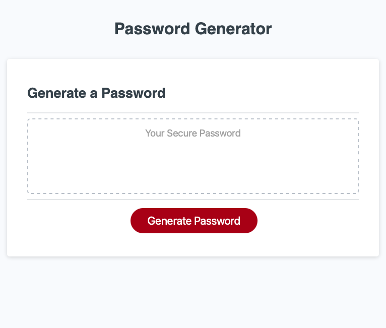

# Password Generator
The project goal was to create a random password generator. The generator prompts the user to select a password length and character types to include in the password. The input is validated and a password with the selected criteria is written to the page.

The website can be found [here](https://amelia-was.github.io/password-generator/)

## Built Using
- HTML
- CSS
- JavaScript
